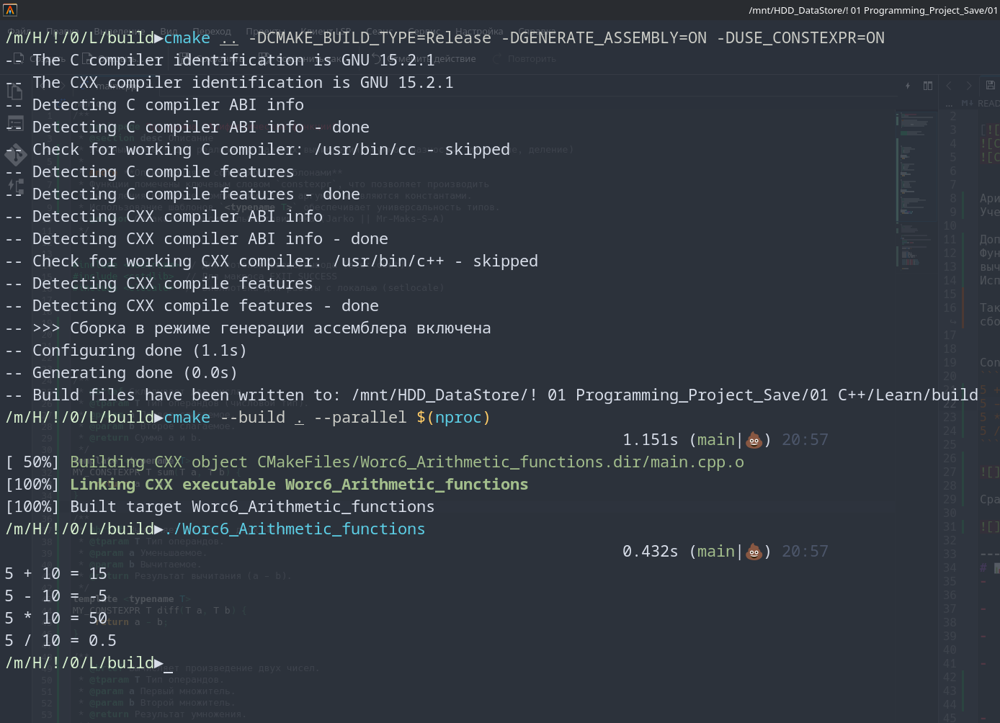
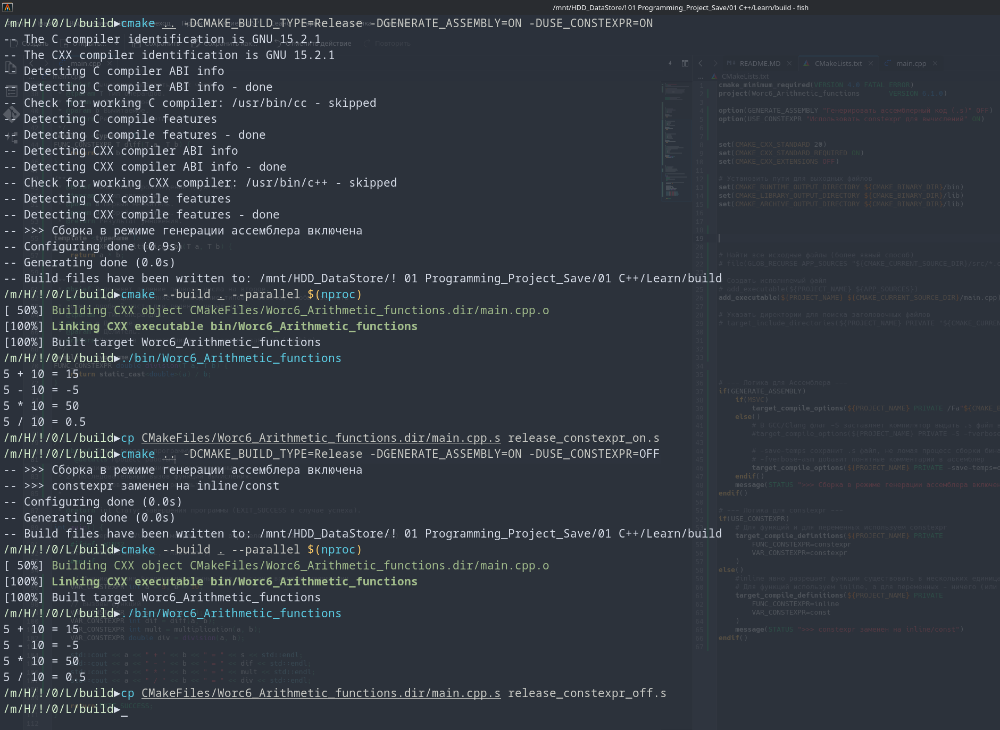
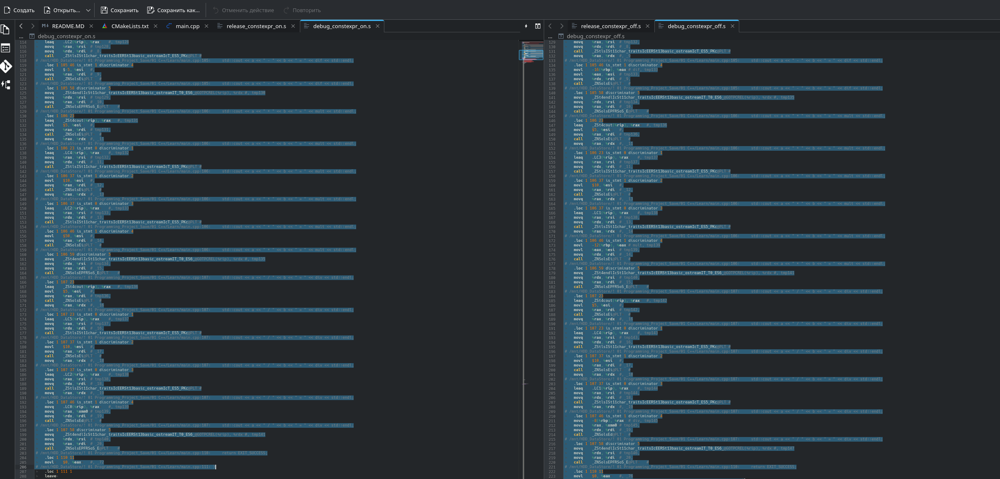

# Лог обучения

[](https://opensource.org/licenses/MIT)


## Арифметические функции<br>
Учебный проект для реализации базовых вычислений (сумма, разность, умножение, деление)<br>

Дополнительно от себя:<br>
Функции помечены ключевым словом `constexpr`(FUNC_CONSTEXPR/VAR_CONSTEXPR), что позволяет производить
вычисления на этапе компиляции, если аргументы являются константами.
Использование шаблонов `<typename T>` обеспечивает универсальность типов.

Так же для самого себя проведены встройки для генерации отдельных assembler фалов(просто чтобы они оставались после сборки).
 Relese версия не рассматривалась так как она всегда применяет максимальную оптимизацию.

файлы ассемблера доступны в репозитории.<br>
Console Out:<br>
```
5 + 10 = 15
5 - 10 = -5
5 * 10 = 50
5 / 10 = 0.5
```



## Сравнение:
в режиме debug c выключенным constexpr 197 строк (224-27)
в режиме debug c включенным constexpr 179 строк (206-27)

разница 18 строк (для достаточно маленькой программы)


### сравнение версий ассемблера:<br>

#### debug_constexpr_OFF:
```assembler
# /mnt/HDD_DataStore/! 01 Programming_Project_Save/01 C++/Learn/main.cpp:96:     VAR_CONSTEXPR int a = 5, b = 10;
	.loc 1 96 15
	movl	$5, -28(%rbp)	#, a
# /mnt/HDD_DataStore/! 01 Programming_Project_Save/01 C++/Learn/main.cpp:96:     VAR_CONSTEXPR int a = 5, b = 10;
	.loc 1 96 22
	movl	$10, -24(%rbp)	#, b
# /mnt/HDD_DataStore/! 01 Programming_Project_Save/01 C++/Learn/main.cpp:99:     VAR_CONSTEXPR int s = sum(a, b);
	.loc 1 99 22
	movl	$10, %esi	#,
	movl	$5, %edi	#,
	call	_Z3sumIiET_S0_S0_	#
	movl	%eax, -20(%rbp)	# tmp120, s
# /mnt/HDD_DataStore/! 01 Programming_Project_Save/01 C++/Learn/main.cpp:100:     VAR_CONSTEXPR int dif = diff(a, b);
	.loc 1 100 25
	movl	$10, %esi	#,
	movl	$5, %edi	#,
	call	_Z4diffIiET_S0_S0_	#
	movl	%eax, -16(%rbp)	# tmp121, dif
# /mnt/HDD_DataStore/! 01 Programming_Project_Save/01 C++/Learn/main.cpp:101:     VAR_CONSTEXPR int mult = multiplication(a, b);
	.loc 1 101 36
	movl	$10, %esi	#,
	movl	$5, %edi	#,
	call	_Z14multiplicationIiET_S0_S0_	#
	movl	%eax, -12(%rbp)	# tmp122, mult
# /mnt/HDD_DataStore/! 01 Programming_Project_Save/01 C++/Learn/main.cpp:102:     VAR_CONSTEXPR double div = division(a, b);
	.loc 1 102 32
	movl	$10, %esi	#,
	movl	$5, %edi	#,
	call	_Z8divisionIiEdT_S0_	#
	movq	%xmm0, %rax	#, tmp123
	movq	%rax, -8(%rbp)	# tmp123, div
```

#### debug_constexpr_ON:
```assembler
# /mnt/HDD_DataStore/! 01 Programming_Project_Save/01 C++/Learn/main.cpp:96:     VAR_CONSTEXPR int a = 5, b = 10;
	.loc 1 96 19
	movl	$5, -28(%rbp)	#, a
# /mnt/HDD_DataStore/! 01 Programming_Project_Save/01 C++/Learn/main.cpp:96:     VAR_CONSTEXPR int a = 5, b = 10;
	.loc 1 96 26
	movl	$10, -24(%rbp)	#, b
# /mnt/HDD_DataStore/! 01 Programming_Project_Save/01 C++/Learn/main.cpp:99:     VAR_CONSTEXPR int s = sum(a, b);
	.loc 1 99 19
	movl	$15, -20(%rbp)	#, s
# /mnt/HDD_DataStore/! 01 Programming_Project_Save/01 C++/Learn/main.cpp:100:     VAR_CONSTEXPR int dif = diff(a, b);
	.loc 1 100 19
	movl	$-5, -16(%rbp)	#, dif
# /mnt/HDD_DataStore/! 01 Programming_Project_Save/01 C++/Learn/main.cpp:101:     VAR_CONSTEXPR int mult = multiplication(a, b);
	.loc 1 101 19
	movl	$50, -12(%rbp)	#, mult
# /mnt/HDD_DataStore/! 01 Programming_Project_Save/01 C++/Learn/main.cpp:102:     VAR_CONSTEXPR double div = division(a, b);
	.loc 1 102 22
	movsd	.LC0(%rip), %xmm0	#, tmp120
	movsd	%xmm0, -8(%rbp)	# tmp120, div
```





---
# 📊 Прогресс обучения
-  9  **Указатели. Массивы и параметры функций**<br>
 
-  8  **Область видимости переменных и типы памяти. Пространства имён**<br>
 
-  7  **Модель памяти и хранение данных**<br>
 
-  6  **Функции и их параметры. Рекурсия**<br>
   - [x] Задание 1. Арифметические функции ([Ref](https://github.com/Mr-Maks-S-A/Learn/tree/v6.1#))<br>
   - [x] Задание 2. Устранение дублирования ([Ref](https://github.com/Mr-Maks-S-A/Learn/tree/v6.2#))<br>
   - [x] Задание 3. Числа Фибоначчи ([Ref](https://github.com/Mr-Maks-S-A/Learn/tree/v6.3#))<br>
-  5  **Массивы**
   - [x] Задание 1. Вывод массива на экран ([Ref](https://github.com/Mr-Maks-S-A/Learn/tree/v5.1#))<br>
   - [x] Задание 2. Максимум и минимум ([Ref](https://github.com/Mr-Maks-S-A/Learn/tree/v5.2#))<br>
   - [x] Задание 3. Двумерный массив ([Ref](https://github.com/Mr-Maks-S-A/Learn/tree/v5.3#))<br>
   - [x] Задание 4. Обратный пузырёк ([Ref](https://github.com/Mr-Maks-S-A/Learn/tree/v5.4#))<br>
 - 4  **Циклические конструкции** <br>
   - [x] Задание 1. Сумматор ([Ref](https://github.com/Mr-Maks-S-A/Learn/tree/v4.1#))<br>
   - [x] Задание 2. Сумма цифр числа ([Ref](https://github.com/Mr-Maks-S-A/Learn/tree/v4.2#))<br>
   - [x] Задание 3. Таблица умножения для числа ([Ref](https://github.com/Mr-Maks-S-A/Learn/tree/v4.3#))<br>
 - 3  **Операторы ветвления. Логические операции** <br>
   - [x] Задание 1. Таблица истинности ([Ref](https://github.com/Mr-Maks-S-A/Learn/tree/v3.1#))<br>
   - [x] Задание 2. Упорядочить числа ([Ref](https://github.com/Mr-Maks-S-A/Learn/tree/v3.2#))<br>
   - [x] Задание 3. Гороскоп ([Ref](https://github.com/Mr-Maks-S-A/Learn/tree/v3.3#))<br>
   - [x] Задание 4. Сравнить числа ([Ref](https://github.com/Mr-Maks-S-A/Learn/tree/v3.4#))<br>
 - 2  **Переменные и их типы** <br>
   - [x] Задание 1. Повторите число ([Ref](https://github.com/Mr-Maks-S-A/Learn/tree/v2.1#))<br>
   - [x] Задание 2. Повторите слово ([Ref](https://github.com/Mr-Maks-S-A/Learn/tree/v2.2#))<br>
 - 1  **Установка окружения**<br>
   - [x] Установка Компилятора ([Ref](https://github.com/Mr-Maks-S-A/Learn/tree/v1.0#))<br>
