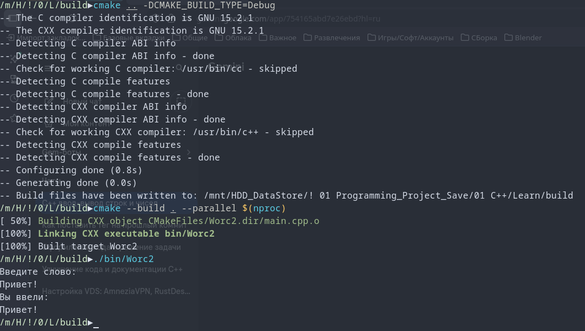

# Лог обучения

[](https://opensource.org/licenses/MIT)


Программа "Повторите слово" <br>
Программа запрашивает у пользователя слово и выводит его обратно на экран.<br>
через стандартные потоки ввода (std::cin) и вывода (std::cout).<br>

Console Out:<br>
```
  Введите слово:
  Привет!
  Вы ввели:
  Привет!
```
Проект создан в учебных целях.



---
# 📊 Прогресс обучения

2) **Переменные и их типы** 
  - [x] Задание 1. Повторите число ([Ref](https://github.com/Mr-Maks-S-A/Learn/tree/v2.1#))
  - [x] Задание 2. Повторите слово ([Ref](https://github.com/Mr-Maks-S-A/Learn/tree/v2.2#))
1) **Установка окружения**
  - [x] Установка Компилятора ([Ref](https://github.com/Mr-Maks-S-A/Learn/tree/v1.0#))
