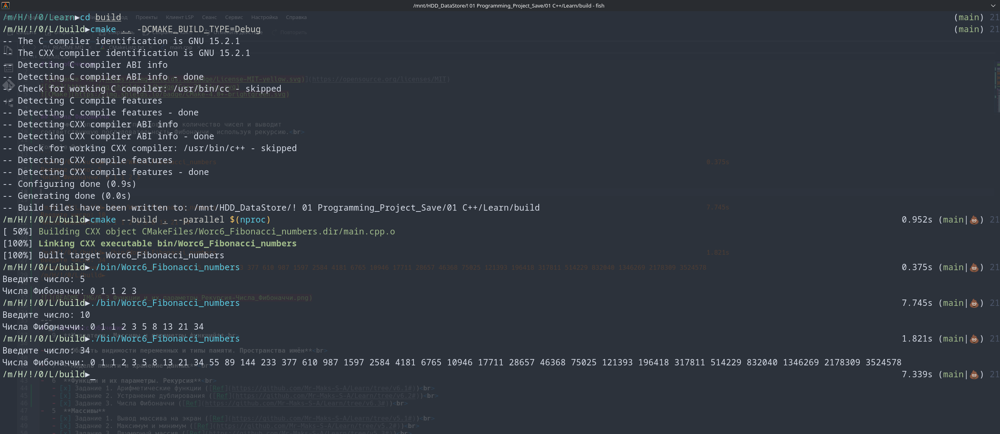

# Лог обучения

[](https://opensource.org/licenses/MIT)


## Числа Фибоначчи
Программа запрашивает у пользователя количество чисел и выводит 
соответствующую последовательность Фибоначчи, используя рекурсию.<br>

Console Out:<br>
```
/m/H/!/0/L/build►./bin/Worc6_Fibonacci_numbers                                                                                                                                0.375s 
Введите число: 5
Числа Фибоначчи: 0 1 1 2 3
```

```
/m/H/!/0/L/build►./bin/Worc6_Fibonacci_numbers                                                                                                                                7.745s 
Введите число: 10
Числа Фибоначчи: 0 1 1 2 3 5 8 13 21 34
```

```
/m/H/!/0/L/build►./bin/Worc6_Fibonacci_numbers                                                                                                                                1.821s 
Введите число: 34
Числа Фибоначчи: 0 1 1 2 3 5 8 13 21 34 55 89 144 233 377 610 987 1597 2584 4181 6765 10946 17711 28657 46368 75025 121393 196418 317811 514229 832040 1346269 2178309 3524578
/m/H/!/0/L/build►  
```




---
# 📊 Прогресс обучения
-  9  **Указатели. Массивы и параметры функций**<br>
 
-  8  **Область видимости переменных и типы памяти. Пространства имён**<br>
 
-  7  **Модель памяти и хранение данных**<br>
 
-  6  **Функции и их параметры. Рекурсия**<br>
   - [x] Задание 1. Арифметические функции ([Ref](https://github.com/Mr-Maks-S-A/Learn/tree/v6.1#))<br>
   - [x] Задание 2. Устранение дублирования ([Ref](https://github.com/Mr-Maks-S-A/Learn/tree/v6.2#))<br>
   - [x] Задание 3. Числа Фибоначчи ([Ref](https://github.com/Mr-Maks-S-A/Learn/tree/v6.3#))<br>
-  5  **Массивы**
   - [x] Задание 1. Вывод массива на экран ([Ref](https://github.com/Mr-Maks-S-A/Learn/tree/v5.1#))<br>
   - [x] Задание 2. Максимум и минимум ([Ref](https://github.com/Mr-Maks-S-A/Learn/tree/v5.2#))<br>
   - [x] Задание 3. Двумерный массив ([Ref](https://github.com/Mr-Maks-S-A/Learn/tree/v5.3#))<br>
   - [x] Задание 4. Обратный пузырёк ([Ref](https://github.com/Mr-Maks-S-A/Learn/tree/v5.4#))<br>
 - 4  **Циклические конструкции** <br>
   - [x] Задание 1. Сумматор ([Ref](https://github.com/Mr-Maks-S-A/Learn/tree/v4.1#))<br>
   - [x] Задание 2. Сумма цифр числа ([Ref](https://github.com/Mr-Maks-S-A/Learn/tree/v4.2#))<br>
   - [x] Задание 3. Таблица умножения для числа ([Ref](https://github.com/Mr-Maks-S-A/Learn/tree/v4.3#))<br>
 - 3  **Операторы ветвления. Логические операции** <br>
   - [x] Задание 1. Таблица истинности ([Ref](https://github.com/Mr-Maks-S-A/Learn/tree/v3.1#))<br>
   - [x] Задание 2. Упорядочить числа ([Ref](https://github.com/Mr-Maks-S-A/Learn/tree/v3.2#))<br>
   - [x] Задание 3. Гороскоп ([Ref](https://github.com/Mr-Maks-S-A/Learn/tree/v3.3#))<br>
   - [x] Задание 4. Сравнить числа ([Ref](https://github.com/Mr-Maks-S-A/Learn/tree/v3.4#))<br>
 - 2  **Переменные и их типы** <br>
   - [x] Задание 1. Повторите число ([Ref](https://github.com/Mr-Maks-S-A/Learn/tree/v2.1#))<br>
   - [x] Задание 2. Повторите слово ([Ref](https://github.com/Mr-Maks-S-A/Learn/tree/v2.2#))<br>
 - 1  **Установка окружения**<br>
   - [x] Установка Компилятора ([Ref](https://github.com/Mr-Maks-S-A/Learn/tree/v1.0#))<br>
