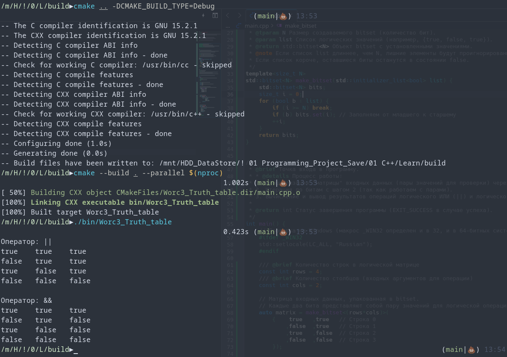

# Лог обучения

[](https://opensource.org/licenses/MIT)


Программа "Таблица истинности" <br>
Она выводит таблицу истинности для логических операторов ||, &&, с применением логических выражений.

Console Out:<br>
```
Оператор: ||
true	true	true
false	true	true
true	false	true
false	false	false

Оператор: &&
true	true	true
false	true	false
true	false	false
false	false	false
```
Проект создан в учебных целях.



---
# 📊 Прогресс обучения
3) **Операторы ветвления. Логические операции** 
  - [x] Задание 1. Таблица истинности ([Ref](https://github.com/Mr-Maks-S-A/Learn/tree/v3.1#))
  - [] Задание 2. Упорядочить числа ([Ref](https://github.com/Mr-Maks-S-A/Learn/tree/v3.2#))
  - [] Задание 3. Гороскоп ([Ref](https://github.com/Mr-Maks-S-A/Learn/tree/v3.3#))
  - [] Задание 4. Сравнить числа ([Ref](https://github.com/Mr-Maks-S-A/Learn/tree/v3.4#))
2) **Переменные и их типы** 
  - [x] Задание 1. Повторите число ([Ref](https://github.com/Mr-Maks-S-A/Learn/tree/v2.1#))
  - [x] Задание 2. Повторите слово ([Ref](https://github.com/Mr-Maks-S-A/Learn/tree/v2.2#))
1) **Установка окружения**
  - [x] Установка Компилятора ([Ref](https://github.com/Mr-Maks-S-A/Learn/tree/v1.0#))
