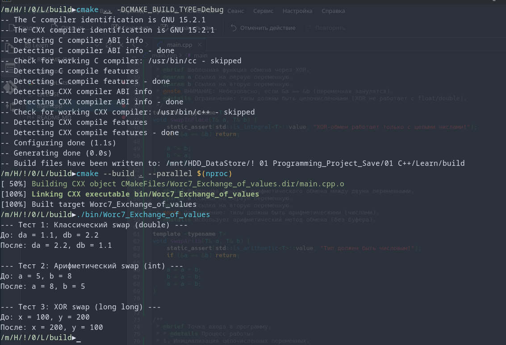
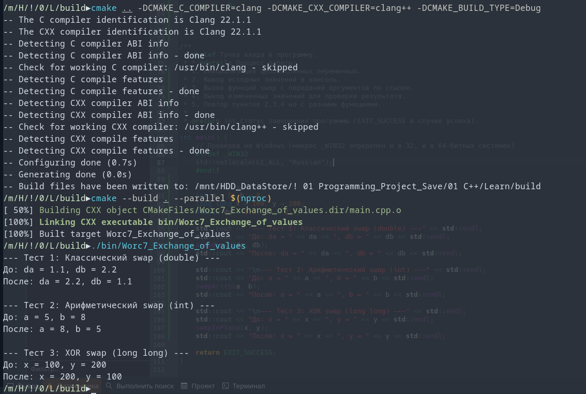

[](https://opensource.org/licenses/MIT)


## Обмен значениями
Демонстрация работы ссылок в C++ на примере функции swap. <br>
Примечание<br>
Реализованы алгоритмы обмена значений без использования временной переменной.


### Console Out:<br>
OS: CachyOS x86_64<br>
Kernel: Linux 6.19.9-1-cachyos<br>
Shell: fish 4.5.0<br>
DE: KDE Plasma 6.6.3<br>
WM: KWin (Wayland)<br>
Terminal: alacritty 0.16.1<br>
CPU: AMD Ryzen 7 3700X (16) @ 4.43 GHz<br>
Locale: ru_RU.UTF-8 (+en_US.utf8)<br>

---
```
--- Тест 1: Классический swap (double) ---
До: da = 1.1, db = 2.2
После: da = 2.2, db = 1.1

--- Тест 2: Арифметический swap (int) ---
До: a = 5, b = 8
После: a = 8, b = 5

--- Тест 3: XOR swap (long long) ---
До: x = 100, y = 200
После: x = 200, y = 100
```
**GCC_GNU 15.2.1/Debug**

**Clang 22.1.1/Debug**



---
# 📊 Прогресс обучения
-  9  **Указатели. Массивы и параметры функций**<br>
 
-  8  **Область видимости переменных и типы памяти. Пространства имён**<br>
 
-  7  **Модель памяти и хранение данных**<br>
   - [x] Задание 1. Адреса переменных ([Ref](https://github.com/Mr-Maks-S-A/Learn/tree/v7.1#))<br>
   - [x] Задание 2. Обмен значениями ([Ref](https://github.com/Mr-Maks-S-A/Learn/tree/v7.2#))<br>
-  6  **Функции и их параметры. Рекурсия**<br>
   - [x] Задание 1. Арифметические функции ([Ref](https://github.com/Mr-Maks-S-A/Learn/tree/v6.1#))<br>
   - [x] Задание 2. Устранение дублирования ([Ref](https://github.com/Mr-Maks-S-A/Learn/tree/v6.2#))<br>
   - [x] Задание 3. Числа Фибоначчи ([Ref](https://github.com/Mr-Maks-S-A/Learn/tree/v6.3#))<br>
-  5  **Массивы**
   - [x] Задание 1. Вывод массива на экран ([Ref](https://github.com/Mr-Maks-S-A/Learn/tree/v5.1#))<br>
   - [x] Задание 2. Максимум и минимум ([Ref](https://github.com/Mr-Maks-S-A/Learn/tree/v5.2#))<br>
   - [x] Задание 3. Двумерный массив ([Ref](https://github.com/Mr-Maks-S-A/Learn/tree/v5.3#))<br>
   - [x] Задание 4. Обратный пузырёк ([Ref](https://github.com/Mr-Maks-S-A/Learn/tree/v5.4#))<br>
 - 4  **Циклические конструкции** <br>
   - [x] Задание 1. Сумматор ([Ref](https://github.com/Mr-Maks-S-A/Learn/tree/v4.1#))<br>
   - [x] Задание 2. Сумма цифр числа ([Ref](https://github.com/Mr-Maks-S-A/Learn/tree/v4.2#))<br>
   - [x] Задание 3. Таблица умножения для числа ([Ref](https://github.com/Mr-Maks-S-A/Learn/tree/v4.3#))<br>
 - 3  **Операторы ветвления. Логические операции** <br>
   - [x] Задание 1. Таблица истинности ([Ref](https://github.com/Mr-Maks-S-A/Learn/tree/v3.1#))<br>
   - [x] Задание 2. Упорядочить числа ([Ref](https://github.com/Mr-Maks-S-A/Learn/tree/v3.2#))<br>
   - [x] Задание 3. Гороскоп ([Ref](https://github.com/Mr-Maks-S-A/Learn/tree/v3.3#))<br>
   - [x] Задание 4. Сравнить числа ([Ref](https://github.com/Mr-Maks-S-A/Learn/tree/v3.4#))<br>
 - 2  **Переменные и их типы** <br>
   - [x] Задание 1. Повторите число ([Ref](https://github.com/Mr-Maks-S-A/Learn/tree/v2.1#))<br>
   - [x] Задание 2. Повторите слово ([Ref](https://github.com/Mr-Maks-S-A/Learn/tree/v2.2#))<br>
 - 1  **Установка окружения**<br>
   - [x] Установка Компилятора ([Ref](https://github.com/Mr-Maks-S-A/Learn/tree/v1.0#))<br>
