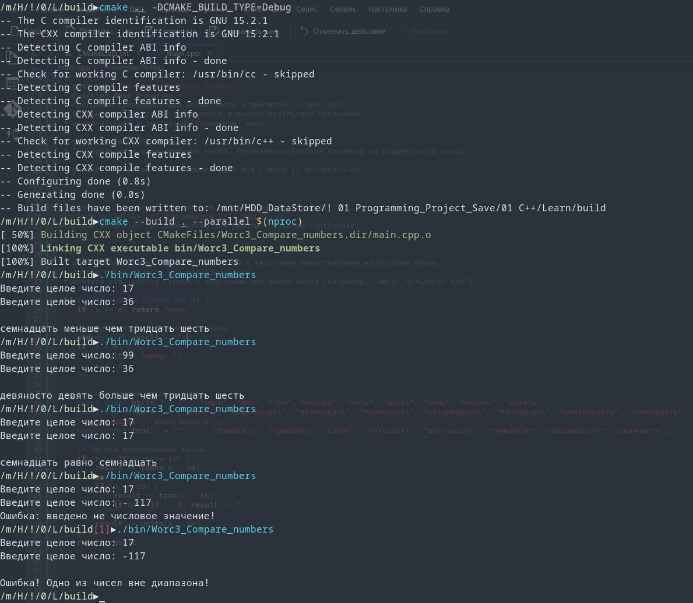

# Лог обучения

[](https://opensource.org/licenses/MIT)


Программа "Сравнить числа" <br>
Программа сравнивает два целых числа в диапазоне (-100, 100).<br>
Особенность программы заключается в выводе результата сравнения<br>
исключительно в текстовом (словесном) виде.<br>

Console Out:<br>
```
Введите целое число: 17
Введите целое число: 36

семнадцать меньше чем тридцать шесть
```

```
Введите целое число: 99
Введите целое число: 36

девяносто девять больше чем тридцать шесть
```

```
Введите целое число: 17
Введите целое число: 17

семнадцать равно семнадцать
```

```
Введите целое число: 17
Введите целое число: -117

Ошибка! Одно из чисел вне диапазона!
```
Проект создан в учебных целях.



---
# 📊 Прогресс обучения
4) **Циклические конструкции** 
  - [x] Задание 1. Сумматор ([Ref](https://github.com/Mr-Maks-S-A/Learn/tree/v4.1#))
  - [x] Задание 2. Сумма цифр числа ([Ref](https://github.com/Mr-Maks-S-A/Learn/tree/v4.2#))
  - [] Задание 3. Таблица умножения для числа ([Ref](https://github.com/Mr-Maks-S-A/Learn/tree/v4.3#))
3) **Операторы ветвления. Логические операции** 
  - [x] Задание 1. Таблица истинности ([Ref](https://github.com/Mr-Maks-S-A/Learn/tree/v3.1#))
  - [x] Задание 2. Упорядочить числа ([Ref](https://github.com/Mr-Maks-S-A/Learn/tree/v3.2#))
  - [x] Задание 3. Гороскоп ([Ref](https://github.com/Mr-Maks-S-A/Learn/tree/v3.3#))
  - [x] Задание 4. Сравнить числа ([Ref](https://github.com/Mr-Maks-S-A/Learn/tree/v3.4#))
2) **Переменные и их типы** 
  - [x] Задание 1. Повторите число ([Ref](https://github.com/Mr-Maks-S-A/Learn/tree/v2.1#))
  - [x] Задание 2. Повторите слово ([Ref](https://github.com/Mr-Maks-S-A/Learn/tree/v2.2#))
1) **Установка окружения**
  - [x] Установка Компилятора ([Ref](https://github.com/Mr-Maks-S-A/Learn/tree/v1.0#))
s
