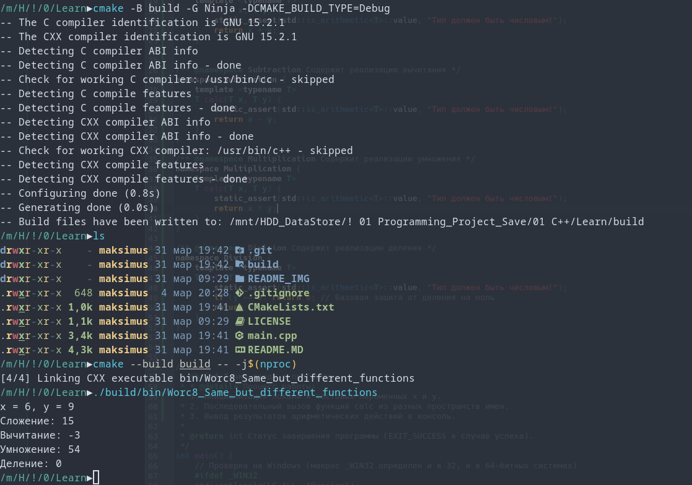
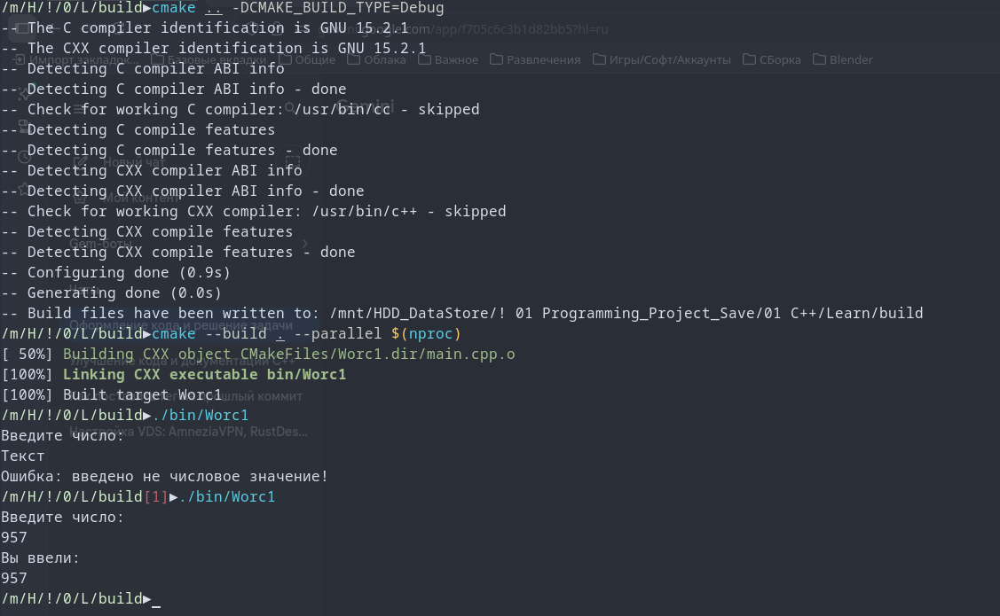
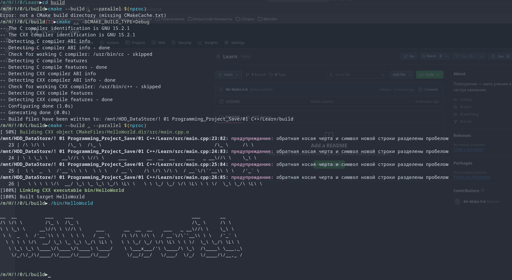

<div align="right">
  <a href="https://github.com/Mr-Maks-S-A/Learn">
    
  </a>
  <a href="#">
    
  </a>
</div>

<div align="center">

[](https://opensource.org/licenses/MIT)


# 💻 C++ Learning Journey
</div>


> **Примечание:** 

### 🖥️ Окружение 
| Property | Value |
| :--- | :--- |
| **OS** | CachyOS x86_64 (Linux 6.19.9) |
| **DE/WM** | KDE Plasma 6.6.3 / KWin (Wayland) |
| **Shell** | fish 4.5.0 |
| **Terminal** | alacritty 0.16.1 |
| **CPU** | AMD Ryzen 7 3700X @ 4.43 GHz |

### 🚀 Пример работы программы

#### Вывод в консоль
```code
la la la
```


### 🖼️ Preview

####  Commands
```bash
cmake --help
```

---

### 📊 Прогресс обучения

<details open>
<summary><b>1 Основы программирования на C++</b></summary>
<br>

  <details>
    <summary><b>📂 1.9.0 Указатели. Массивы и параметры функций</b></summary>
    <br>
    <table width="100%">
      <tr>
        <td width="20%" style="border: none;"></td>
        <td style="border: none;">
          <table width="100%">
            <thead>
              <tr align="center">
                <th width="10%">Статус</th>
                <th width="10%">ID</th>
                <th>Описание задачи</th>
                <th width="15%">Ссылка</th>
              </tr>
            </thead>
            <tbody>
              <tr align="center">
                <td>⏳</td>
                <td><code>1.9.1</code></td>
                <td align="left">Вывод массива</td>
                <td><a href="https://github.com/Mr-Maks-S-A/Learn/tree/v1.9.1"></a></td>
              </tr>
              <tr align="center">
                <td>⏳</td>
                <td><code>1.9.2</code></td>
                <td align="left">Снова swap</td>
                <td><a href="https://github.com/Mr-Maks-S-A/Learn/tree/v1.9.2"></a></td>
              </tr>
              <tr align="center">
                <td>⏳</td>
                <td><code>1.9.3</code></td>
                <td align="left">Переворот массива</td>
                <td><a href="https://github.com/Mr-Maks-S-A/Learn/tree/v1.9.3"></a></td>
              </tr>
            </tbody>
          </table>
        </td>
      </tr>
    </table>
  </details>

  <details>
    <summary><b>📂 1.8.0 Область видимости и пространства имён</b></summary>
    <br>
    <table width="100%">
      <tr>
        <td width="20%" style="border: none;"></td>
        <td style="border: none;">
          <table width="100%">
            <thead>
              <tr align="center">
                <th width="10%">Статус</th>
                <th width="10%">ID</th>
                <th>Описание задачи</th>
                <th width="15%">Ссылка</th>
              </tr>
            </thead>
            <tbody>
              <tr align="center">
                <td>✅</td>
                <td><code>1.8.1</code></td>
                <td align="left">Считающая функция</td>
                <td><a href="https://github.com/Mr-Maks-S-A/Learn/tree/v8.1"></a></td>
              </tr>
              <tr align="center">
                <td>✅</td>
                <td><code>1.8.2</code></td>
                <td align="left">Одинаковые, но разные функции</td>
                <td><a href="https://github.com/Mr-Maks-S-A/Learn/tree/v8.2"></a></td>
              </tr>
            </tbody>
          </table>
        </td>
      </tr>
    </table>
  </details>

  <details>
    <summary><b>📂 1.7.0 Модель памяти и хранение данных</b></summary>
    <br>
    <table width="100%">
      <tr>
        <td width="20%" style="border: none;"></td>
        <td style="border: none;">
          <table width="100%">
            <thead>
              <tr align="center">
                <th width="10%">Статус</th>
                <th width="10%">ID</th>
                <th>Описание задачи</th>
                <th width="15%">Ссылка</th>
              </tr>
            </thead>
            <tbody>
              <tr align="center">
                <td>✅</td>
                <td><code>1.7.1</code></td>
                <td align="left">Адреса переменных</td>
                <td><a href="https://github.com/Mr-Maks-S-A/Learn/tree/v7.1"></a></td>
              </tr>
              <tr align="center">
                <td>✅</td>
                <td><code>1.7.2</code></td>
                <td align="left">Обмен значениями</td>
                <td><a href="https://github.com/Mr-Maks-S-A/Learn/tree/v7.2"></a></td>
              </tr>
            </tbody>
          </table>
        </td>
      </tr>
    </table>
  </details>

  <details>
    <summary><b>📂 1.6.0 Функции и их параметры. Рекурсия</b></summary>
    <br>
    <table width="100%">
      <tr>
        <td width="20%" style="border: none;"></td>
        <td style="border: none;">
          <table width="100%">
            <thead>
              <tr align="center">
                <th width="10%">Статус</th>
                <th width="10%">ID</th>
                <th>Описание задачи</th>
                <th width="15%">Ссылка</th>
              </tr>
            </thead>
            <tbody>
              <tr align="center">
                <td>✅</td>
                <td><code>1.6.1</code></td>
                <td align="left">Арифметические функции</td>
                <td><a href="https://github.com/Mr-Maks-S-A/Learn/tree/v6.1"></a></td>
              </tr>
              <tr align="center">
                <td>✅</td>
                <td><code>1.6.2</code></td>
                <td align="left">Устранение дублирования</td>
                <td><a href="https://github.com/Mr-Maks-S-A/Learn/tree/v6.2"></a></td>
              </tr>
              <tr align="center">
                <td>✅</td>
                <td><code>1.6.3</code></td>
                <td align="left">Числа Фибоначчи</td>
                <td><a href="https://github.com/Mr-Maks-S-A/Learn/tree/v6.3"></a></td>
              </tr>
            </tbody>
          </table>
        </td>
      </tr>
    </table>
  </details>

  <details>
    <summary><b>📂 1.5.0 Массивы</b></summary>
    <br>
    <table width="100%">
      <tr>
        <td width="20%" style="border: none;"></td>
        <td style="border: none;">
          <table width="100%">
            <thead>
              <tr align="center">
                <th width="10%">Статус</th>
                <th width="10%">ID</th>
                <th>Описание задачи</th>
                <th width="15%">Ссылка</th>
              </tr>
            </thead>
            <tbody>
              <tr align="center">
                <td>✅</td>
                <td><code>1.5.1</code></td>
                <td align="left">Вывод массива на экран</td>
                <td><a href="https://github.com/Mr-Maks-S-A/Learn/tree/v5.1"></a></td>
              </tr>
              <tr align="center">
                <td>✅</td>
                <td><code>1.5.2</code></td>
                <td align="left">Максимум и минимум</td>
                <td><a href="https://github.com/Mr-Maks-S-A/Learn/tree/v5.2"></a></td>
              </tr>
              <tr align="center">
                <td>✅</td>
                <td><code>1.5.3</code></td>
                <td align="left">Двумерный массив</td>
                <td><a href="https://github.com/Mr-Maks-S-A/Learn/tree/v5.3"></a></td>
              </tr>
              <tr align="center">
                <td>✅</td>
                <td><code>1.5.4</code></td>
                <td align="left">Обратный пузырёк</td>
                <td><a href="https://github.com/Mr-Maks-S-A/Learn/tree/v5.4"></a></td>
              </tr>
            </tbody>
          </table>
        </td>
      </tr>
    </table>
  </details>

  <details>
    <summary><b>📂 1.4.0 Циклические конструкции</b></summary>
    <br>
    <table width="100%">
      <tr>
        <td width="20%" style="border: none;"></td>
        <td style="border: none;">
          <table width="100%">
            <thead>
              <tr align="center">
                <th width="10%">Статус</th>
                <th width="10%">ID</th>
                <th>Описание задачи</th>
                <th width="15%">Ссылка</th>
              </tr>
            </thead>
            <tbody>
              <tr align="center">
                <td>✅</td>
                <td><code>1.4.1</code></td>
                <td align="left">Сумматор</td>
                <td><a href="https://github.com/Mr-Maks-S-A/Learn/tree/v4.1"></a></td>
              </tr>
              <tr align="center">
                <td>✅</td>
                <td><code>1.4.2</code></td>
                <td align="left">Сумма цифр числа</td>
                <td><a href="https://github.com/Mr-Maks-S-A/Learn/tree/v4.2"></a></td>
              </tr>
              <tr align="center">
                <td>✅</td>
                <td><code>1.4.3</code></td>
                <td align="left">Таблица умножения для числа</td>
                <td><a href="https://github.com/Mr-Maks-S-A/Learn/tree/v4.3"></a></td>
              </tr>
            </tbody>
          </table>
        </td>
      </tr>
    </table>
  </details>

  <details>
    <summary><b>📂 1.3.0 Операторы ветвления. Логические операции</b></summary>
    <br>
    <table width="100%">
      <tr>
        <td width="20%" style="border: none;"></td>
        <td style="border: none;">
          <table width="100%">
            <thead>
              <tr align="center">
                <th width="10%">Статус</th>
                <th width="10%">ID</th>
                <th>Описание задачи</th>
                <th width="15%">Ссылка</th>
              </tr>
            </thead>
            <tbody>
              <tr align="center">
                <td>✅</td>
                <td><code>1.3.1</code></td>
                <td align="left">Таблица истинности</td>
                <td><a href="https://github.com/Mr-Maks-S-A/Learn/tree/v3.1"></a></td>
              </tr>
              <tr align="center">
                <td>✅</td>
                <td><code>1.3.2</code></td>
                <td align="left">Упорядочить числа</td>
                <td><a href="https://github.com/Mr-Maks-S-A/Learn/tree/v3.2"></a></td>
              </tr>
              <tr align="center">
                <td>✅</td>
                <td><code>1.3.3</code></td>
                <td align="left">Гороскоп</td>
                <td><a href="https://github.com/Mr-Maks-S-A/Learn/tree/v3.3"></a></td>
              </tr>
              <tr align="center">
                <td>✅</td>
                <td><code>1.3.4</code></td>
                <td align="left">Сравнить числа</td>
                <td><a href="https://github.com/Mr-Maks-S-A/Learn/tree/v3.3"></a></td>
              </tr>
            </tbody>
          </table>
        </td>
      </tr>
    </table>
  </details>

  <details>
    <summary><b>📂 1.2.0 Переменные и их типы</b></summary>
    <br>
    <table width="100%">
      <tr>
        <td width="20%" style="border: none;"></td>
        <td style="border: none;">
          <table width="100%">
            <thead>
              <tr align="center">
                <th width="10%">Статус</th>
                <th width="10%">ID</th>
                <th>Описание задачи</th>
                <th width="20%">Preview</th>
                <th width="15%">Ссылка</th>
              </tr>
            </thead>
            <tbody>
              <tr align="center">
                <td>✅</td>
                <td><code>1.2.1</code></td>
                <td align="left">Повторите число</td>
                <td>
                  <a href="https://github.com/Mr-Maks-S-A/Learn/blob/main/README_IMG/2.1_Переменные_и_их_типы-Повторите_Число.png">
                    
                  </a>
                </td>
                <td><a href="https://github.com/Mr-Maks-S-A/Learn/tree/v2.1"></a></td>
              </tr>
              <tr align="center">
                <td>✅</td>
                <td><code>1.2.2</code></td>
                <td align="left">Повторите слово</td>
                <td>
                  <a href="https://github.com/Mr-Maks-S-A/Learn/blob/main/README_IMG/2.2_Переменные_и_их_типы-Повторите_слово.png">
                    
                  </a>
                </td>
                <td><a href="https://github.com/Mr-Maks-S-A/Learn/tree/v2.2"></a></td>
              </tr>
            </tbody>
          </table>
        </td>
      </tr>
    </table>
  </details>

  <details>
    <summary><b>📂 1.1.0 Знакомство с C++</b></summary>
    <br>
    <table width="100%">
      <tr>
        <td width="20%" style="border: none;"></td>
        <td style="border: none;">
          <table width="100%">
            <thead>
              <tr align="center">
                <th width="10%">Статус</th>
                <th width="10%">ID</th>
                <th>Описание задачи</th>
                <th width="20%">Preview</th>
                <th width="15%">Ссылка</th>
              </tr>
            </thead>
            <tbody>
              <tr align="center">
                <td>✅</td>
                <td><code>1.1.1</code></td>
                <td align="left">Написать первую программу</td>
                <td>
                  <a href="https://github.com/Mr-Maks-S-A/Learn/blob/main/README_IMG/1.1_Helloworld.png">
                    
                  </a>
                </td>
                <td><a href="https://github.com/Mr-Maks-S-A/Learn/tree/v1.0"></a></td>
              </tr>
            </tbody>
          </table>
        </td>
      </tr>
    </table>
  </details>

</details>


