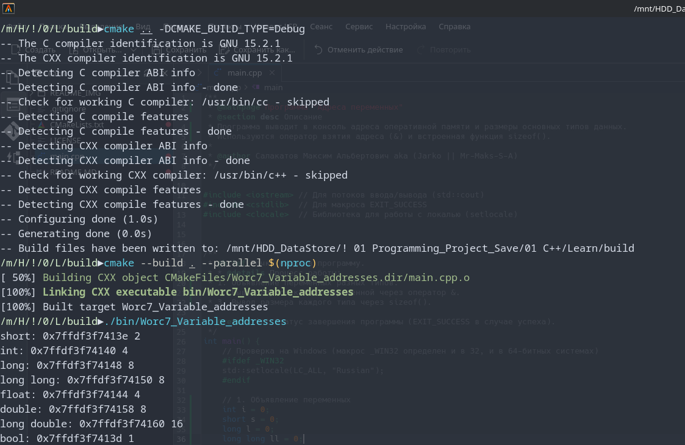
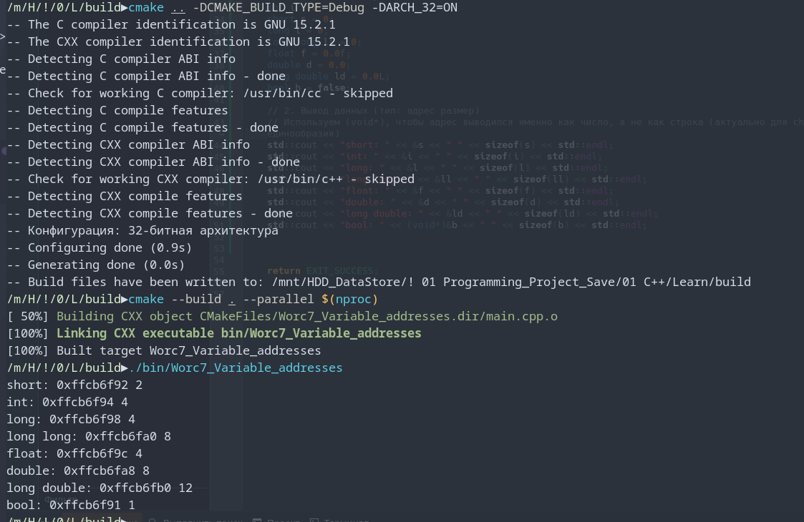
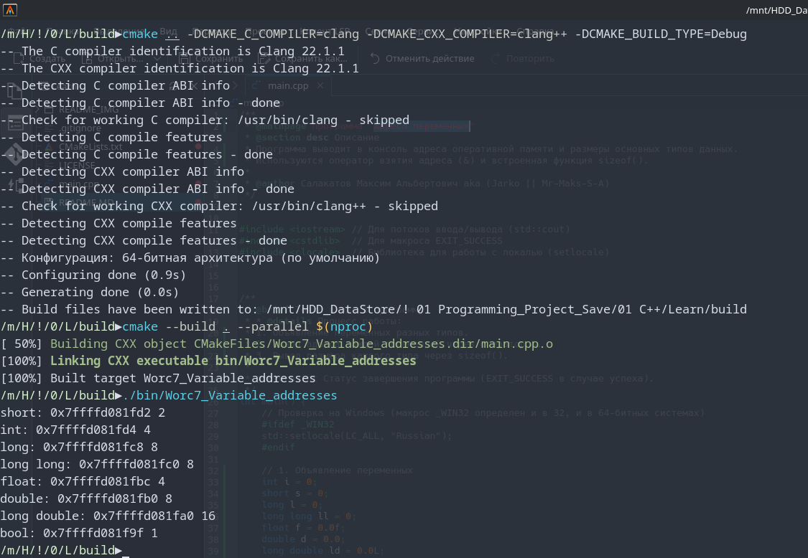
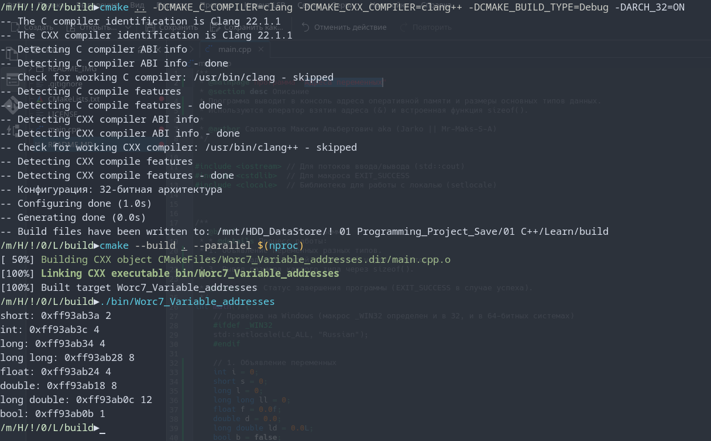

[](https://opensource.org/licenses/MIT)


## Адреса переменных
Программа выводит в консоль адреса оперативной памяти и размеры основных типов данных.
Используются оператор взятия адреса (&) и встроенная функция sizeof().<br>


### Console Out:<br>
OS: CachyOS x86_64<br>
Kernel: Linux 6.19.9-1-cachyos<br>
Shell: fish 4.5.0<br>
DE: KDE Plasma 6.6.3<br>
WM: KWin (Wayland)<br>
Terminal: alacritty 0.16.1<br>
CPU: AMD Ryzen 7 3700X (16) @ 4.43 GHz<br>
Locale: ru_RU.UTF-8 (+en_US.utf8)<br>

<br>
<br>
---
**GCC_GNU 15.2.1/x64/Debug**
```
short: 0x7ffdf3f7413e 2
int: 0x7ffdf3f74140 4
long: 0x7ffdf3f74148 8
long long: 0x7ffdf3f74150 8
float: 0x7ffdf3f74144 4
double: 0x7ffdf3f74158 8
long double: 0x7ffdf3f74160 16
bool: 0x7ffdf3f7413d 1
```

<br>
---
**GCC_GNU 15.2.1/x86(32)/Debug**
```
short: 0xffcb6f92 2
int: 0xffcb6f94 4
long: 0xffcb6f98 4
long long: 0xffcb6fa0 8
float: 0xffcb6f9c 4
double: 0xffcb6fa8 8
long double: 0xffcb6fb0 12
bool: 0xffcb6f91 1
```

<br>
<br>
<br>
---
**Clang 22.1.1/x64/Debug**
```
short: 0x7ffffd081fd2 2
int: 0x7ffffd081fd4 4
long: 0x7ffffd081fc8 8
long long: 0x7ffffd081fc0 8
float: 0x7ffffd081fbc 4
double: 0x7ffffd081fb0 8
long double: 0x7ffffd081fa0 16
bool: 0x7ffffd081f9f 1
```

<br>
---
**Clang 22.1.1/x86(32)/Debug**
```
short: 0xff93ab3a 2
int: 0xff93ab3c 4
long: 0xff93ab34 4
long long: 0xff93ab28 8
float: 0xff93ab24 4
double: 0xff93ab18 8
long double: 0xff93ab0c 12
bool: 0xff93ab0b 1
```

<br>
<br>
<br>
---
# 📊 Прогресс обучения
-  9  **Указатели. Массивы и параметры функций**<br>
 
-  8  **Область видимости переменных и типы памяти. Пространства имён**<br>
 
-  7  **Модель памяти и хранение данных**<br>
   - [x] Задание 1. Адреса переменных ([Ref](https://github.com/Mr-Maks-S-A/Learn/tree/v7.1#))<br>
   - [x] Задание 2. Обмен значениями ([Ref](https://github.com/Mr-Maks-S-A/Learn/tree/v7.2#))<br>
-  6  **Функции и их параметры. Рекурсия**<br>
   - [x] Задание 1. Арифметические функции ([Ref](https://github.com/Mr-Maks-S-A/Learn/tree/v6.1#))<br>
   - [x] Задание 2. Устранение дублирования ([Ref](https://github.com/Mr-Maks-S-A/Learn/tree/v6.2#))<br>
   - [x] Задание 3. Числа Фибоначчи ([Ref](https://github.com/Mr-Maks-S-A/Learn/tree/v6.3#))<br>
-  5  **Массивы**
   - [x] Задание 1. Вывод массива на экран ([Ref](https://github.com/Mr-Maks-S-A/Learn/tree/v5.1#))<br>
   - [x] Задание 2. Максимум и минимум ([Ref](https://github.com/Mr-Maks-S-A/Learn/tree/v5.2#))<br>
   - [x] Задание 3. Двумерный массив ([Ref](https://github.com/Mr-Maks-S-A/Learn/tree/v5.3#))<br>
   - [x] Задание 4. Обратный пузырёк ([Ref](https://github.com/Mr-Maks-S-A/Learn/tree/v5.4#))<br>
 - 4  **Циклические конструкции** <br>
   - [x] Задание 1. Сумматор ([Ref](https://github.com/Mr-Maks-S-A/Learn/tree/v4.1#))<br>
   - [x] Задание 2. Сумма цифр числа ([Ref](https://github.com/Mr-Maks-S-A/Learn/tree/v4.2#))<br>
   - [x] Задание 3. Таблица умножения для числа ([Ref](https://github.com/Mr-Maks-S-A/Learn/tree/v4.3#))<br>
 - 3  **Операторы ветвления. Логические операции** <br>
   - [x] Задание 1. Таблица истинности ([Ref](https://github.com/Mr-Maks-S-A/Learn/tree/v3.1#))<br>
   - [x] Задание 2. Упорядочить числа ([Ref](https://github.com/Mr-Maks-S-A/Learn/tree/v3.2#))<br>
   - [x] Задание 3. Гороскоп ([Ref](https://github.com/Mr-Maks-S-A/Learn/tree/v3.3#))<br>
   - [x] Задание 4. Сравнить числа ([Ref](https://github.com/Mr-Maks-S-A/Learn/tree/v3.4#))<br>
 - 2  **Переменные и их типы** <br>
   - [x] Задание 1. Повторите число ([Ref](https://github.com/Mr-Maks-S-A/Learn/tree/v2.1#))<br>
   - [x] Задание 2. Повторите слово ([Ref](https://github.com/Mr-Maks-S-A/Learn/tree/v2.2#))<br>
 - 1  **Установка окружения**<br>
   - [x] Установка Компилятора ([Ref](https://github.com/Mr-Maks-S-A/Learn/tree/v1.0#))<br>
