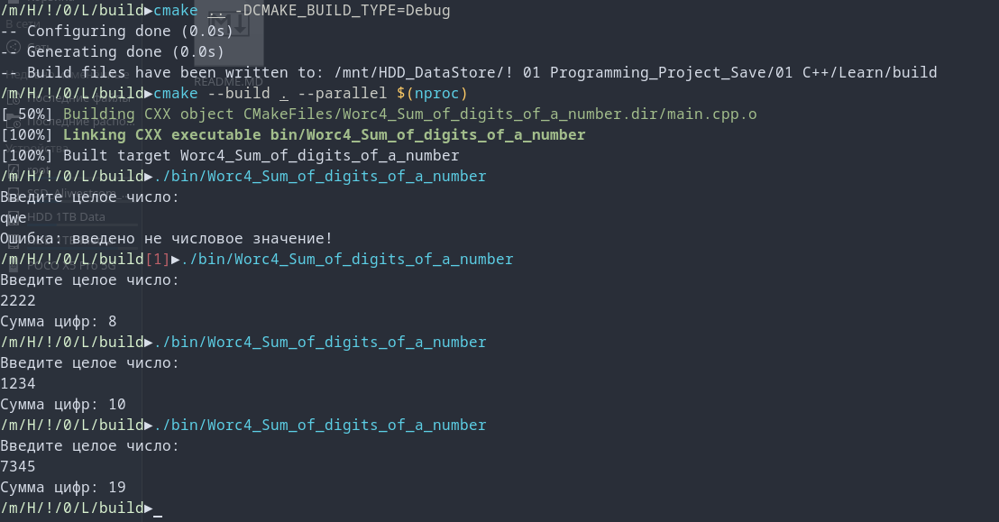

# Лог обучения

[](https://opensource.org/licenses/MIT)


Программа "Сумма цифр числа" <br>
  Программа вычисляет сумму цифр целого числа, введенного пользователем.
  
  Примечания <br>
  Для корректной работы с отрицательными числами используется функция abs().

Console Out:<br>
```
Введите целое число:
qwe
Ошибка: введено не числовое значение!
```

```
Введите целое число:
1234
Сумма цифр: 10
```

```
Введите целое число:
7345
Сумма цифр: 19
```

Проект создан в учебных целях.



---
# 📊 Прогресс обучения
4) **Циклические конструкции** 
  - [x] Задание 1. Сумматор ([Ref](https://github.com/Mr-Maks-S-A/Learn/tree/v4.1#))
  - [x] Задание 2. Сумма цифр числа ([Ref](https://github.com/Mr-Maks-S-A/Learn/tree/v4.2#))
  - [] Задание 3. Таблица умножения для числа ([Ref](https://github.com/Mr-Maks-S-A/Learn/tree/v4.3#))
3) **Операторы ветвления. Логические операции** 
  - [x] Задание 1. Таблица истинности ([Ref](https://github.com/Mr-Maks-S-A/Learn/tree/v3.1#))
  - [x] Задание 2. Упорядочить числа ([Ref](https://github.com/Mr-Maks-S-A/Learn/tree/v3.2#))
  - [x] Задание 3. Гороскоп ([Ref](https://github.com/Mr-Maks-S-A/Learn/tree/v3.3#))
  - [x] Задание 4. Сравнить числа ([Ref](https://github.com/Mr-Maks-S-A/Learn/tree/v3.4#))
2) **Переменные и их типы** 
  - [x] Задание 1. Повторите число ([Ref](https://github.com/Mr-Maks-S-A/Learn/tree/v2.1#))
  - [x] Задание 2. Повторите слово ([Ref](https://github.com/Mr-Maks-S-A/Learn/tree/v2.2#))
1) **Установка окружения**
  - [x] Установка Компилятора ([Ref](https://github.com/Mr-Maks-S-A/Learn/tree/v1.0#))
s
