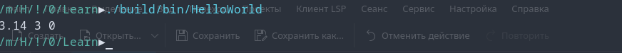

# Лог обучения

Данное приложение демонстрирует базовые навыки работы с типами данных, 
явное приведение типов и вывод информации в консоль. 

Console Out: 
3.14 3 0 

Проект создан в учебных целях.

---
# Завершонные задания 0->10 ^:
    - [ ] Переменные и их типы (Ref: )
        - [ ] Задание 1. Повторите число  (Ref: )
        - [ ] Задание 2. Повторите слово (Ref: )
    - [x] Установка Компилятора (Ref: https://github.com/Mr-Maks-S-A/Learn/tree/v1.0#)
