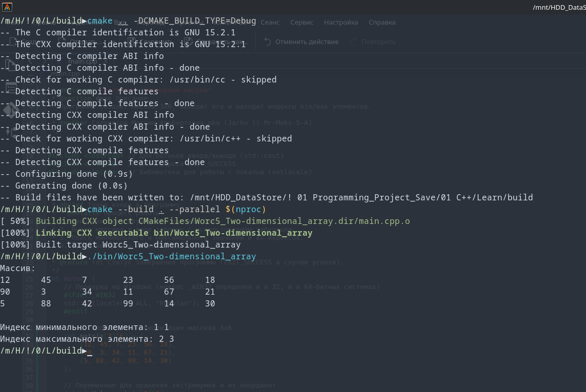

# Лог обучения

[](https://opensource.org/licenses/MIT)


Двумерный массив<br>
Программа создает массив 3x6, выводит его и находит индексы min/max элементов.<br>


Console Out:<br>
```
Массив:
12	45	7	23	56	18	
90	3	34	11	67	21	
5	88	42	99	14	30	

Индекс минимального элемента: 1 1
Индекс максимального элемента: 2 3
```
Проект создан в учебных целях.



---
# 📊 Прогресс обучения
-  9  **Указатели. Массивы и параметры функций**<br>
 
-  8  **Область видимости переменных и типы памяти. Пространства имён**<br>
 
-  7  **Модель памяти и хранение данных**<br>
 
-  6  **Функции и их параметры. Рекурсия**<br>

-  5  **Массивы**
   - [x] Задание 1. Вывод массива на экран ([Ref](https://github.com/Mr-Maks-S-A/Learn/tree/v5.1#))<br>
   - [x] Задание 2. Максимум и минимум ([Ref](https://github.com/Mr-Maks-S-A/Learn/tree/v5.2#))<br>
   - [x] Задание 3. Двумерный массив ([Ref](https://github.com/Mr-Maks-S-A/Learn/tree/v5.3#))<br>
   - [x] Задание 4. Обратный пузырёк ([Ref](https://github.com/Mr-Maks-S-A/Learn/tree/v5.4#))<br>
 - 4  **Циклические конструкции** <br>
   - [x] Задание 1. Сумматор ([Ref](https://github.com/Mr-Maks-S-A/Learn/tree/v4.1#))<br>
   - [x] Задание 2. Сумма цифр числа ([Ref](https://github.com/Mr-Maks-S-A/Learn/tree/v4.2#))<br>
   - [x] Задание 3. Таблица умножения для числа ([Ref](https://github.com/Mr-Maks-S-A/Learn/tree/v4.3#))<br>
 - 3  **Операторы ветвления. Логические операции** <br>
   - [x] Задание 1. Таблица истинности ([Ref](https://github.com/Mr-Maks-S-A/Learn/tree/v3.1#))<br>
   - [x] Задание 2. Упорядочить числа ([Ref](https://github.com/Mr-Maks-S-A/Learn/tree/v3.2#))<br>
   - [x] Задание 3. Гороскоп ([Ref](https://github.com/Mr-Maks-S-A/Learn/tree/v3.3#))<br>
   - [x] Задание 4. Сравнить числа ([Ref](https://github.com/Mr-Maks-S-A/Learn/tree/v3.4#))<br>
 - 2  **Переменные и их типы** <br>
   - [x] Задание 1. Повторите число ([Ref](https://github.com/Mr-Maks-S-A/Learn/tree/v2.1#))<br>
   - [x] Задание 2. Повторите слово ([Ref](https://github.com/Mr-Maks-S-A/Learn/tree/v2.2#))<br>
 - 1  **Установка окружения**<br>
   - [x] Установка Компилятора ([Ref](https://github.com/Mr-Maks-S-A/Learn/tree/v1.0#))<br>
