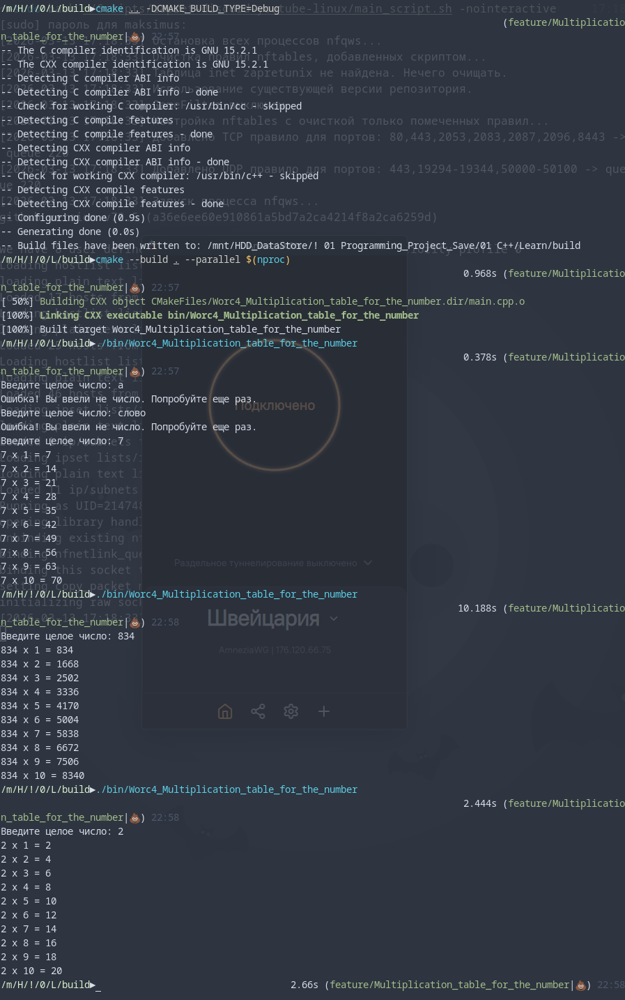

# Лог обучения

[](https://opensource.org/licenses/MIT)


Программа "Таблица умножения для числа" <br>
  Программа запрашивает у пользователя целое число и выводит таблицу
  умножения для этого числа от 1 до 10.

  
  Примечания
   Реализована проверка ввода: при вводе некорректных данных (не чисел)
  программа запрашивает ввод повторно.
   В коде использован метод std::cin.ignore для очистки буфера.
  Это предпочтительнее ручного цикла while(std::cin.get()), так как:
   1. Работает быстрее (оптимизировано под блоки данных).
   2. Безопасно обрабатывает ситуацию конца файла (EOF).
   3. Не требует посимвольной проверки в пользовательском цикле.
Console Out:<br>
```
Введите целое число: a
Ошибка! Вы ввели не число. Попробуйте еще раз.
Введите целое число: слово
Ошибка! Вы ввели не число. Попробуйте еще раз.
Введите целое число: 7
7 x 1 = 7
7 x 2 = 14
7 x 3 = 21
7 x 4 = 28
7 x 5 = 35
7 x 6 = 42
7 x 7 = 49
7 x 8 = 56
7 x 9 = 63
7 x 10 = 70
```

```
Введите целое число: 834
834 x 1 = 834
834 x 2 = 1668
834 x 3 = 2502
834 x 4 = 3336
834 x 5 = 4170
834 x 6 = 5004
834 x 7 = 5838
834 x 8 = 6672
834 x 9 = 7506
834 x 10 = 8340
```
```
Введите целое число: 2
2 x 1 = 2
2 x 2 = 4
2 x 3 = 6
2 x 4 = 8
2 x 5 = 10
2 x 6 = 12
2 x 7 = 14
2 x 8 = 16
2 x 9 = 18
2 x 10 = 20
```
Проект создан в учебных целях.



---
# 📊 Прогресс обучения
4) **Циклические конструкции** 
  - [x] Задание 1. Сумматор ([Ref](https://github.com/Mr-Maks-S-A/Learn/tree/v4.1#))
  - [x] Задание 2. Сумма цифр числа ([Ref](https://github.com/Mr-Maks-S-A/Learn/tree/v4.2#))
  - [x] Задание 3. Таблица умножения для числа ([Ref](https://github.com/Mr-Maks-S-A/Learn/tree/v4.3#))
3) **Операторы ветвления. Логические операции** 
  - [x] Задание 1. Таблица истинности ([Ref](https://github.com/Mr-Maks-S-A/Learn/tree/v3.1#))
  - [x] Задание 2. Упорядочить числа ([Ref](https://github.com/Mr-Maks-S-A/Learn/tree/v3.2#))
  - [x] Задание 3. Гороскоп ([Ref](https://github.com/Mr-Maks-S-A/Learn/tree/v3.3#))
  - [x] Задание 4. Сравнить числа ([Ref](https://github.com/Mr-Maks-S-A/Learn/tree/v3.4#))
2) **Переменные и их типы** 
  - [x] Задание 1. Повторите число ([Ref](https://github.com/Mr-Maks-S-A/Learn/tree/v2.1#))
  - [x] Задание 2. Повторите слово ([Ref](https://github.com/Mr-Maks-S-A/Learn/tree/v2.2#))
1) **Установка окружения**
  - [x] Установка Компилятора ([Ref](https://github.com/Mr-Maks-S-A/Learn/tree/v1.0#))
